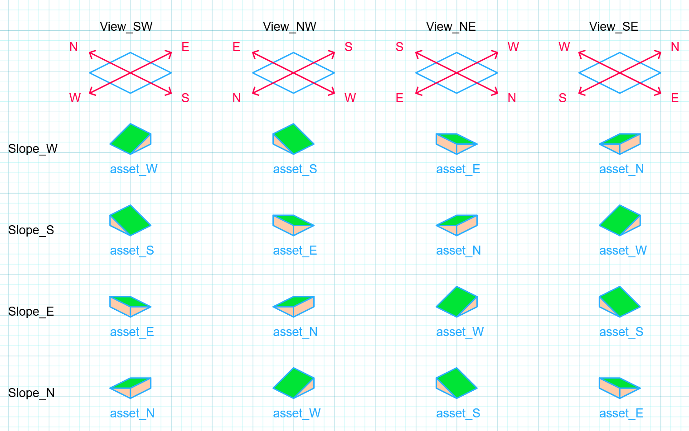
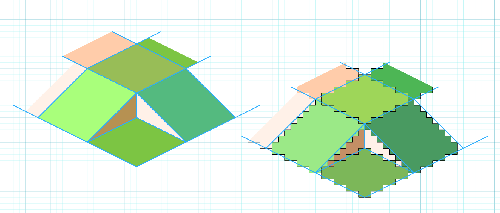
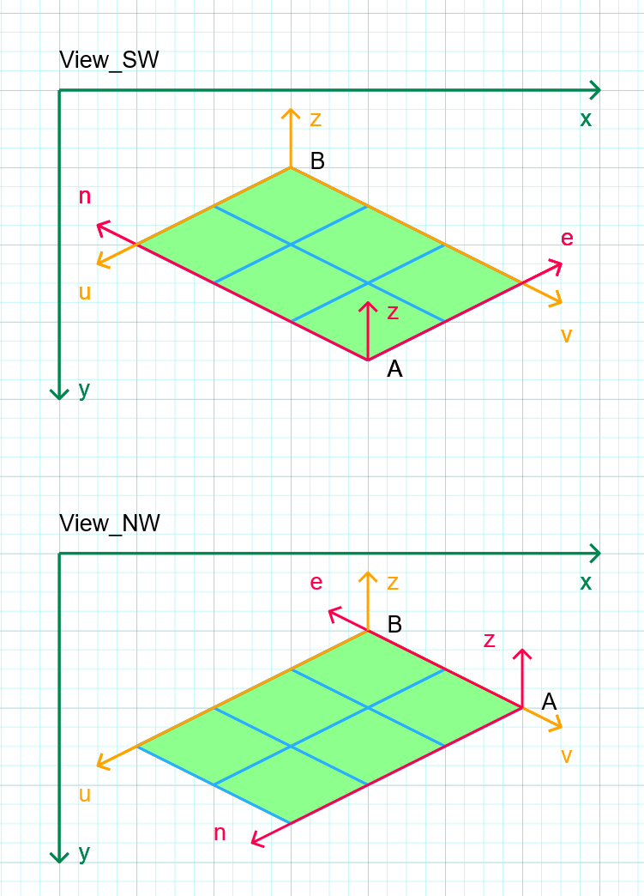

# Geometry of the isometric map

## Orientation in assets and tiles on the map

The map grid axis align are west to east and south to north. The map can be viewed in four orientations, each view is named after the location of the camera.
The base view is `View_SW` where the camera is located in the south west. 
Therefore in this view North is in the top left, east in the top right, west in the bottom left and south in the bottom right of the screen.
The top line of the following graphics shows the naming convention for each orientation of the map grid.

The assets (image files) are named after their orientation in the `View_SW`. The lower part of the image above shows a sloped tile. If it is oriented toward 
the west in the map coordinate system (top row `Slope_W`) and viewed from the north east (third column `View_NE`) the same asset is used as for a tile sloped 
east (third row `Slope_E`) and viewed from the south west (first column `View_SW`), namely the image `asset_E`.

## Alignment of Tile borders with Pixels

The theoretical tile borders (blue lines in the picture) are aligned with the corners of the pixels. In order to have a seamless joining of tiles, 
the pixels on both sides of the border need to be chosen consistently. Here the arrangement is demonstrated for 16x8 pixel base tiles and also for sloped tiles.
Note that the lines along the axis on the bottom form consistent 2:1 Pixel steps. Note also that the base tile is only 14 pixels wide, even though the theoretical 
tile is 16 pixels wide.

This concept probably will have to be refined in oder to allow a smoother transition between different tiles (e.g. grass to dirt) or between tiles of
different slopes, and thus different lighting.

## Coordinate Systems

There are three coordinate systems used:

*  **The map (or world) coordinate system (e,n,z)** The origin of this coordinate system is in the south west corner (A) of the map, at the edge of the tile. 
   Coordinate e counts tiles to the east and coordinate n counts tiles to the north. The z coordinate is the height.
       
*  **The view (or camera) coordinate system (u,v,z)** The origin of this coordinate system is always at the corner of the map, which appears topmost on the screen (B).
   It is thus always the opposite corner from the camera position. In `View_SW` it is the NE corner.
   The u axis always extends towards the bottom left on the screen and the v axis towards the bottom right. The z axis is identical to the map coordinate system.
   
*  **The screen coordinate system (x,y)** The unit is pixels. As usual the x coordinate runs from the left to the right and y runs from top to bottom. 
   The value 0 corresponds to the left or top edge of the screen (or window). The center of the top left pixel thus has the coordinates (0.5px, 0.5px).

The image below illustrates the relationship of the coordinate systems in two different view orientations. 
Point A has coordinates (e=0, n=0, z=0) and point B has coordinates (u=0, v=0, z=0)

### Map to View Coordinates

The link between u,v and e,n depends on the view as shown in the following table. z is the same in both systems.
    
    VIEW_SW            VIEW_NW            VIEW_NE            VIEW_SE
    ===============    ===============    ===============    ===============
    u = SIZE_EW - e    u = n              u = e              u = SIZE_NS - n
    v = SIZE_NS - n    v = SIZE_EW - e    v = n              v = e
 
where `SIZE_EW`is the size of the map in east-west direction and `SIZE_NS` in north-south direction.
 
### View to Screen Coordinates

The scale of the tiles is given by its half width in pixels `TILE_HALF_WIDTH = 64` and the step size in z direction `Z_OFFSET = 16`.
The location, where the map is drawn (scrolling) is determined by an offset (the position of the point B in the images above)

    x = x_offset + TILE_HALF_WIDTH * (v - u)
    y = y_offset + TILE_HALF_WIDTH * (u + v) / 2 - Z_OFFSET * z

